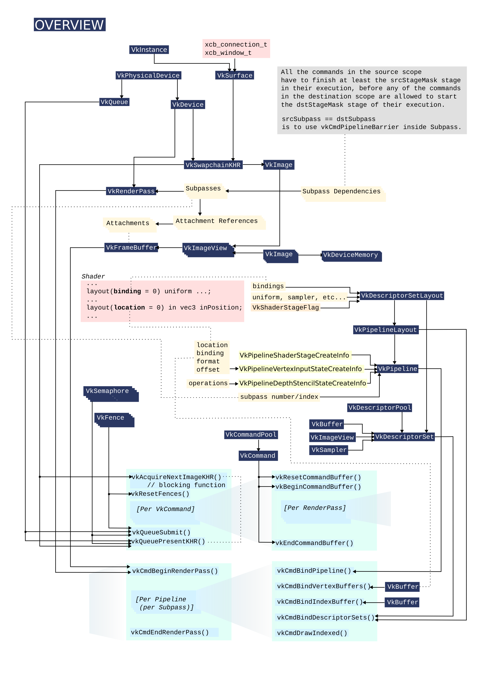
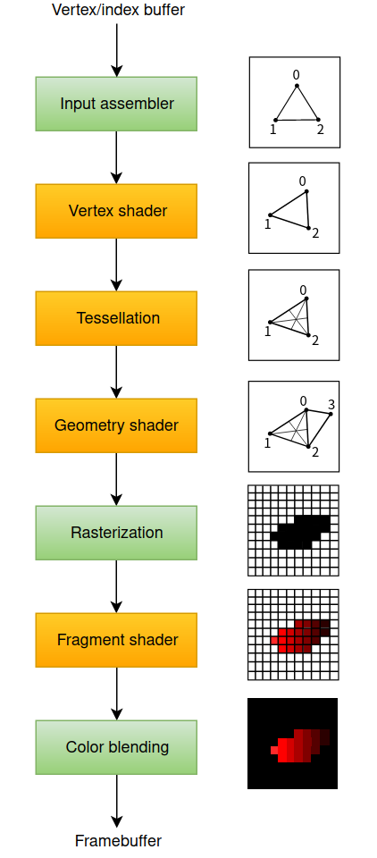
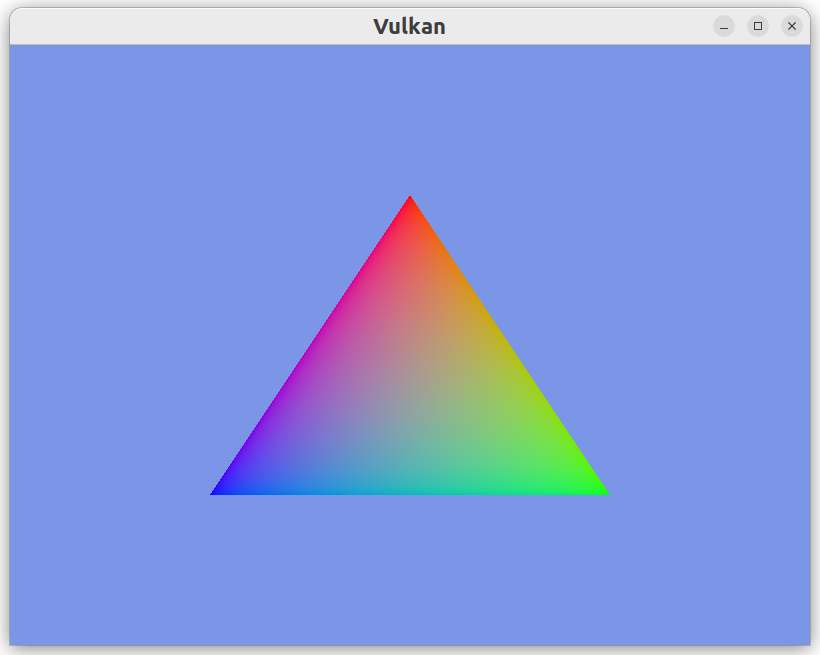

# VulkanLearning
This is a Vulkan learning repository for beginners. You may consider this is a combination of `Vulkan Tutorial` and `Vulkan Specifics`(Links at the end), and I'll try my best to make things as clear as possible since I am a beginner as well.🙃:stuck_out_tongue_winking_eye:

## Notice
This repository does NOT have a build-system yet, but you can modify the CMakeLists.txt easily to support multiple conditions.

**If there is any mistake, please create an issue or correct it.**

## What to do? -- Triangle



### create instance
+ complete application info struct.
+ complete instance create info struct.
    + specify the extensions
    + specify the layers
    + pNext may point to `VkDebugUilsMessengerCreateInfoEXT *`
+ destroy instance when you clean up.
### set up debug messenger
+ complete debug messenger create info struct.
+ create debug messenger by function `vkGetInstanceProcAddr`.
+ destroy debug messenger by function `vkGetInstanceProcAddr` when you clean up.
### create surface
+ if you use glfw library, you can create surface by function `glfwCreateWindowSurface`.
### pick physical device
+ enumerate physical devices.
+ check devices one by one whether they are suitable or not.
    + get its queue family indices by function `vkGetPhysicalDeviceQueueFamilyProperties` to check whether it supports graphics and surface/present.
    + check whether its extensions support out required extensions by function `vkEnumerateDeviceExtensionProperties` to acquire available extensions' properties which contain extension name.
    + check whether its swap chain details, which contain **surface capabilities, surface formats and present modes**, are suitable by function `vkGetPhysicalDevice***KHR`. If the formats and present modes are not empty, we consider swap chain details adequate.
### create logical device 
+ get selected physical device's queue family indices.
+ complete device queue create info struct for each **unique** queue family index.
+ complete device create info struct.
+ destroy device when you clean up.
### create swap chain
+ get selected physical device's swap chain details.
+ choose image extent.
+ choose surface format(image format and image color space).
+ choose present mode.
+ complete swap chain create info struct and ensure the items bellow are setted correctly.
    + `.imageUsage`
    + `.imageSharingMode`
    + `.queueFamilyIndexCount` is the number of queue families having access to the image(s) of the swapchain when imageSharingMode is `VK_SHARING_MODE_CONCURRENT`.
    + `.pQueueFamilyIndices` is a pointer to an array of queue family indices having access to the images(s) of the swapchain when imageSharingMode is `VK_SHARING_MODE_CONCURRENT`.
    + `.preTransform`
    + `.compositeAlpha` is a `VkCompositeAlphaFlagBitsKHR` value indicating the alpha compositing mode to use when this surface is composited together with other surfaces on certain window systems.
    + `.clipped` specifies whether the Vulkan implementation is allowed to discard rendering operations that affect regions of the surface that are not visible.
+ destroy swap chain when you clean up.
### create image views
+ get swap chain images right after you have created swap chain and save image extent, image format.
+ complete image view create info struct for each image.
+ create image view for each image.
+ destroy every image view when you clean up.
### create renderpass
+ renderpass
    + complete render pass create info struct.
        + complete color/depth attachment description struct.
            + `.loadOp` specifies how the contents of color and depth components of the attachment are treated at the beginning of the subpass where it is first used.
            + `.storeOp` specifies how the contents of color and depth components of the attachment are treated at the end of the subpass where it is last used.
            + `.stencilLoadOp` and stencilStoreOp are for stencil data. Some of the common choices are as follows:
                `VK_ATTACHMENT_LOAD_OP_LOAD`:Preserve the existing contents of the attachment.
                `VK_ATTACHMENT_LOAD_OP_CLEAR`:Clear the values to a constant at the start.
                `VK_ATTACHMENT_LOAD_OP_DONT_CARE`:Existing contents are undefined; we don't care about them.
            [More details about VkAttachmentLoadOp](https://registry.khronos.org/vulkan/specs/1.3-extensions/man/html/VkAttachmentLoadOp.html)
            `VK_ATTACHMENT_STORE_OP_STORE`:Rendered contents will be stored in memory and can be read later.
            `VK_ATTACHMENT_STORE_OP_DONT_CARE`:Contents of the framebuffer will be undefined after the rendering operation.
            [More details about VkAttachmentStoreOp](https://registry.khronos.org/vulkan/specs/1.3-extensions/man/html/VkAttachmentStoreOp.html)
            + the image layout specifies the layout of image and image subresources. The most common layouts are:
            `VK_IMAGE_LAYOUT_COLOR_ATTACHMENT_OPTIMAL`:Images used as color attachment
            `VK_IMAGE_LAYOUT_PRESENT_SRC_KHR`:Images to be presented in the swap chain
            `VK_IMAGE_LAYOUT_TRANSFER_DST_OPTIMAL`:Images to be used as destination for a memory copy operation
            [More details about VkImageLayout](https://registry.khronos.org/vulkan/specs/1.3-extensions/man/html/VkImageLayout.html)
        + complete color/depth attachment reference struct.
            + `.attachment` specifies which attachment to reference by its index in the attachment descriptions array.
            ```c++
            VkAttachmentReference colorAttachmentRef{};
            colorAttachmentRef.attachment = 0;
            colorAttachmentRef.layout = VK_IMAGE_LAYOUT_COLOR_ATTACHMENT_OPTIMAL;
            ```
            The index of the attachment in this array is directly referenced from the fragment shader with the `layout(location = 0) out vec4 outColor` directive!
            The following other types of attachments can be referenced by a subpass:
                `pInputAttachments`:Attachments that are read from a shader.
                `pResolveAttachments`:Attachments used for multisampling color attachments.
                `pDepthStencilAttachment`:Attachment for depth and stencil data.
                `pPreserveAttachments`:Attachments that are not used by this subpass, but for which the data must be preserved.
        + complete subpass description struct.
            + its main components are pointers to `VkAttachmentReference`
        + complete subpass dependency struct.
            + subpass dependency specifies memory and execution dependencies between subpasses. We have only a single subpass right now, but the operations right before and right after this subpass also count as implicit "subpasses".
            ```c++
            VkSubpassDependency subpassDependency{};
            subpassDependency.srcSubpass = VK_SUBPASS_EXTERNAL;
            subpassDependency.dstSubpass = 0;
            ```
            The first two fields specify the indices of the dependency and the dependent subpass. The special value `VK_SUBPASS_EXTERNAL` refers to the implicit subpass before or after the render pass depending on whether it is specified in `srcSubpass` or `dstSubpass`. The index `0` refers to our subpass which is the first one.**Note** that the `dstSubpass` must be heigher than `srcSubpass` to prevent cycles, unless one of the subpasses is `VK_SUBPASS_EXTERNAL`.
            ```c++
            subpassDependency.srcStageMask = VK_PIPELINE_STAGE_COLOR_ATTACHMENT_OUTPUT_BIT;
            subpassDependency.srcAccessMask = VK_ACCESS_NONE; // no access cause it is done itself
            ```
            The next two fields specify the operations to wait on and the stages in which these operations occur.
            ```c++
            subpassDependency.dstStageMask = VK_PIPELINE_STAGE_COLOR_ATTACHMENT_OUTPUT_BIT;
            subpassDependency.dstAccessMask = VK_ACCESS_COLOR_ATTACHMENT_WRITE_BIT;
            ```
            The operations that should wait on this are in the color attachment stage and involve the writing of the color attachment.
    + create render pass.
    + destroy render pass when you clean up.
### **create pipeline**




+ **Befor create pipeline, we need to compile and load our shaders and we are using hard code for now. However, don't worry about it, we'll soon create vertex buffer stuff.**
    + use SPIR-V binary tool to compile shader source code.
    + read the compiled binary shader files to our source code.
+ pipeline
    1. complete shader module create info strut with binary shader code to create shader module for both vertex shader and fragment shader.
    2. complete shader stage create info struct for both vertex and fragment shader modules.
    3. complete vertex input state create info struct.
    4. complete input assembly state create info struc which species the binding&attribute descriptions.
        + `.topology` specifies how your vertex data is going to be used. e.g. `VK_PRIMITIVE_TOPOLOGY_TRIANGLE_LIST`
        + `.primitiveRestartEnable` controls whether you can use special vertex index to break "strip" topologies. [More details](https://registry.khronos.org/vulkan/specs/1.3-extensions/man/html/VkPipelineInputAssemblyStateCreateInfo.html)
    5. complete `VkViewport` and `VkRect2D` struct if you don't want to use dynamic state
    6. if you don't want to use dynamic state, complete viewport state create info struct with viewport struct and scissor struct, otherwise specifies the count of viewport and scissor.
    7. complete rasterization state create info struct
        + `.rasterizerDiscardEnable` controls whether primitives are discarded immediately before the rasterization stage.
        + `.cullMode` is the triangle facing direction used for primitive culling. e.g.
        `VK_CULL_MODE_NONE` specifies that no triangles are discarded.
        `VK_CULL_MODE_FRONT_BIT` specifies that front-facing triangles are discarded.
        `VK_CULL_MODE_BACK_BIT` specifies that back-facing triangles are discarded.
        `VK_CULL_MODE_FRONT_AND_BACK` specifies that all triangles are discarded.
        + `.frontFace` specifies the front-facing triangle orientation to be used for culling
    8. complete multisample state create info struct
        + `.rasterizationSamples` is a `VkSampleCountFlagBits` value specifies the number of samples used in rasterization. e.g.
        `VK_SAMPLE_COUNT_4_BIT` specifies an image with 4 samples per pixel.
        + `.sampleShadingEnable` can be used to specify a minimum number of unique samples to process for each fragment and enabling it requires enabling a GPU feature. We don't enable it for now.
    **Two Methods of Color Blending**
    `VkPipelineColorBlendAttachmentState` contains the configuration per attached framebuffer and `VkPipelineColorBlendStateCreateInfo` contains the global color blending settings. 
    9. complete color blend attachemnt state struct--Mix the old and new value to produce a final color
        + `.colorWriteMask` specifies which of the R, G, B, and/or A components are enabled for writing.
        **How to blend**
        ```c++
        if (blendEnable)
        {
            finalColor.rgb = (srcColorBlendFactor * newColor.rgb) <colorBlendOp> (dstColorBlendFactor * oldColor.rgb);
            finalColor.a = (srcAlphaBlendFactor * newColor.a) <alphaBlendOp> (dstAlphaBlendFactor * oldColor.a);
        }
        else
        {
            finalColor = newColor;
        }
        finalColor = finalColor & colorWriteMask;
        ```
        The most common way to use color blending is to implement alpha blending.
        ```c++
        VkPipelineColorBlendAttachmentState colorAttachment{};
        colorAttachment.colorWriteMask = VK_COLOR_COMPONENT_R_BIT | VK_COLOR_COMPONENT_G_BIT | VK_COLOR_COMPONENT_B_BIT | VK_COLOR_COMPONENT_A_BIT;
        colorBlendAttachment.blendEnable = VK_TRUE;
        colorBlendAttachment.srcColorBlendFactor = VK_BLEND_FACTOR_SRC_ALPHA;
        colorBlendAttachment.dstColorBlendFactor = VK_BLEND_FACTOR_ONE_MINUS_SRC_ALPHA;
        colorBlendAttachment.colorBlendOp = VK_BLEND_OP_ADD;
        colorBlendAttachment.srcAlphaBlendFactor = VK_BLEND_FACTOR_ONE;
        colorBlendAttachment.dstAlphaBlendFactor = VK_BLEND_FACTOR_ZERO;
        colorBlendAttachment.alphaBlendOp = VK_BLEND_OP_ADD;
        ```
        Then the final color shoud be compute as follows:
        ```c++
        finalColor.rgb = newAlpha * newColor + (1 - newAlpha) * oldColor;
        finalColor.a = newAlpha.a;
        ```
    10. complete color blend state create info struct--Combine the old and new value using a bitwise operation
        + `.attachmentCount` is the number of `VkPipelineColorBlendAttachmentState` elements in pAttachments.
        + `.pAttachments` is a pointer to an array of `VkPipelineColorBlendAttachmentState` structures defining blend state for each color attachment.
        + `.blendConstants` is a pointer to an array of four values used as the R, G, B, and A components of the blend constant that are used in blending.
        + `.logicOpEnable` controls whether to apply Logical Operations(bitwise combination). **Note** that this will automatically disable the `VkPipelineColorBlendAttachmentState` method if you set logicalOpEnable to `VK_TRUE`, as if you had set `blendEnable` to `VK_FALSE` for every attached framebuffer! The `colorWriteMask` will also be used in this mode to determine which channels in the framebuffer will actually be affected.
    11. complete dynamic state create info struct
        + If you want to use dynamic state and keep these properties out, then you'll have to fill in a `VkPipelineDynamicStateCreateInfo` struct.
        + `.dynamicStateCount` specifies the number of dynamic state.
        + `.pDynamicStates` specifies which pieces of pipeline state will use the values from dynamic state commands rather than from pipeline state creation information.
    12. complete pipeline layout create info struct and create a pipeline layout
        + `.setLayoutCount` is the number of descriptor sets included in the pipeline layout.
        + `.pSetLayouts` is a pointer to an array of `VkDescriptorSetLayout` objects.
        + `.pushConstantRangeCount` is the number of push constant ranges included in the pipeline layout.
        + `.pPushConstantRanges` is a pointer to an array of `VkPushConstantRange` structures defining a set of push constant ranges for use in a single pipeline layout. In addition to descriptor set layouts, a pipeline layout also describes how many push constants can be accessed by each stage of the pipeline.
    13. at last, complete graphics pipeline create info struct
        1. shader stages
        2. vertex input
        3. input assembly
        4. viewport state
        5. rasterization state
        6. multi-sample state
        7. depth stencil state
        8. color blend state
        9. dynamic state
        10. pipeline layout handle
        11. render pass handle
        12. subpass index
        13. base pipeline handle
        14. base pipeline index
    14. create graphics pipeline
    15. destroy graphics pipeline and pipeline layout when you clean up
### create frame buffer
+ complete frame buffer create info struct to create frame buffer for each attachment.
+ attachment is a `VkImageView` type handle, one frame buffer can have multiple attachments.
+ don't forget to specify the swap chain width, height and layers.
+ destroy all frame buffers when you clean up.
### create command pool
+ get selected physical device's queue family indices
+ complete command pool create info struct
    + `.queueFamilyIndex` designates/apoints a queue family to execute command buffers by submitting them on one of the device queues. Each command pool can **only** allocate command buffers that are submitted on a **single** type of queue.
    + `.flags` is a bitmask of `VkCommandPoolCreateFlagBits` indicating usage behavior for the pool and command buffers allocated from it.
    There are two possible flags for command pools:
        `VK_COMMAND_POOL_CREATE_TRANSIENT_BIT`:Hint that command buffers are rerecorded with new commands very often (may change memory allocation behavior).
        `VK_COMMAND_POOL_CREATE_RESET_COMMAND_BUFFER_BIT`:Allow command buffers to be rerecorded individually, without this flag they all have to be reset together.
+ destroy command pool when you clean up
### synchronization object--A core design philosophy in Vulkan
+ outline of a frame
    + Wait for the previous frame to finish
    + Acquire an image from the swap chain
    + Record a command buffer which draws the scene onto that image
    + Submit the recorded command buffer
    + Present the swap chain image
+ semaphores
    Semaphore is used to add order between queue operations because most tasks on GPU or *device* are asynchronous. Semaphores are used both to order work inside the same queue and between different queues. A semaphore is either unsignaled or signaled. The way we use a semaphore to order queue operations is by providing the same semaphore as a 'signal' semaphore in one queue operation and as a 'wait' semaphore in another queue operation.
    For example, lets say we have semaphore S and queue operations A and B that we want to execute in order. What we tell Vulkan is that operation A will 'signal' semaphore S when it finishes executing, and operation B will 'wait' on semaphore S before it begins executing. When operation A finishes, semaphore S will be signaled, while operation B won't start until S is signaled. After operation B begins executing, semaphore S is automatically reset back to being unsignaled, allowing it to be used again.
    *When you implement `VkSemaphoreCreateInfo`, just assign `.sType` for `.flags` is reserved for future use.*
+ fences
    Fences is used to synchronize execution, but it is for ordering the execution on the CPU, otherwise known as the *host*. Simply put, if the host needs to know when the device has finished something, we use a fence. Similar to semaphores, fences are either in a signaled or unsignaled state.
    A concrete example is taking a screenshot. Say we have already done the necessary work on the GPU. Now need to transfer the image from the GPU over to the host and then save the memory to a file. We have command buffer A which executes the transfer and fence F. We submit command buffer A with fence F, then immediately tell the host to wait for F to signal. This causes the host to block until command buffer A finishes execution. Thus we are safe to let the host save the file to disk, as the memory transfer has completed.
    *When you implement `VkFenceCreateInfo`, assign `.flags` to set the initial "signal" state with `VK_FENCE_CREATE_SIGNALED_BIT` only.*
+ frames in flight
    if we only create one command buffer for a framebuffer, we are required to wait on the previous frame to finish before we can start rendering the next which results in unnecessary idling of the host. The way to fix this is to allow multiple frames to be in-flight at once, that is to say, allow the rendering of one frame to not interfere with the recording of the next. Thus, we need multiple command buffers, semaphores, and fences.
### create command buffer
+ complete command buffer allocate info struct
    + `.commandBufferCount` is the number of command buffers to allocate from the pool.
    + `.level` specifies the command buffer level and must be one of the followings:
            `VK_COMMAND_BUFFER_LEVEL_PRIMARY`:Can be submitted to a queue for execution, but cannot be called from other command buffers.
            `VK_COMMAND_BUFFER_LEVEL_SECONDARY`:Cannot be submitted directly, but can be called from primary command buffers.
+ Command buffers will be automatically freed when their command pool is destroyed, so we don't need explicit cleanup.
### draw call
+ wait for previous frame finished by function `vkWaitForFences`
    + The `waitAll` parameter specifies whether we want to wait for all fences in `pFences` parameter.
    + The `timeout` parameter is the timeout period in units of nanoseconds.
+ acquire next image from swap chain by function `vkAcquireNextImageKHR`
    + The `semaphore` and `fence` parameters are used for creating synchronization objects. Since we don't have fences for acquireing image, we use semaphore.
    + The last parameter specifies a variable to output the index of the swap chain image that has become available. The index refers to the `VkImage` in our swap chain image array.
    + The retuened value which tells us when we should recreate swap chain are as follows:
        `VK_ERROR_OUT_OF_DATE_KHR`:The swap chain has become incompatible with the surface and can no longer be used for rendering. Usually happens after a window resize.
        `VK_SUBOPTIMAL_KHR`:The swap chain can still be used to successfully present to the surface, but the surface properties are no longer matched exactly.
    + If `vkAcquireNextImageKHR` returns `VK_ERROR_OUT_OF_DATE_KHR`, we should recreate our swap chain. If it returns `VK_SUBOPTIMAL_KHR`, we could also recreate swap chain for we may want the best possible result.
+ Right after acquireing image, we shall reset the fence by function `vkResetFences`.
+ With the image index specifying swap chain image to use in hand, we can now record command buffer.
    + First, we will reset command buffer to make sure it is able to be recoreded by call `vkResetCommandBuffer` function.
    The last parameter controls the reset operation. Its possible values are as follows:
        `VK_COMMAND_BUFFER_RESET_RELEASE_RESOURCES_BIT` specifies that most or all memory resources currently owned by the command buffer should be returned to the parent command pool. If this flag is not set, then the command buffer may hold onto memory resources and reuse them when recording commands.
    `0` behaves as forementioned.
    + Now we can record our command buffer.
        + complete command buffer begin info struct
            + `.flags` specifies how we're going to use the command buffer. The following values are available:
                `VK_COMMAND_BUFFER_USAGE_ONE_TIME_SUBMIT_BIT`:The command buffer will be rerecorded right after executing it once.
                `VK_COMMAND_BUFFER_USAGE_RENDER_PASS_CONTINUE_BIT`:This is a secondary command buffer that will be entirely within a single render pass.
                `VK_COMMAND_BUFFER_USAGE_SIMULTANEOUS_USE_BIT`:The command buffer can be resubmitted while it is also already pending execution.
            None of these are suitable for now! So we leave it `0` for now.
            + `.pInheritanceInfo` parameter is relevant for secondary command buffers. It specifies which state to inherit from the calling primary command buffers.
        + begin command buffer
        + complete render pass begin info struct
        + cmmand begin render pass
            + `.contents` is a `VkSubpassContents` value which specifies how the commands in the first subpass will be provided. Its possible values are as follows:
                `VK_SUBPASS_CONTENTS_INLINE` specifies that the contents of the subpass will be recorded inline in the primary command buffer, and secondary command buffers must not be executed within the subpass.
                `VK_SUBPASS_CONTENTS_SECONDARY_COMMAND_BUFFERS` specifies that the contents are recorded in secondary command buffers that will be called from the primary command buffer, and vkCmdExecuteCommands is the only valid command on the command buffer until `vkCmdNextSubpass` or `vkCmdEndRenderPass`.
        + command bind pipeline
        + As noted in pipeline creation, we did specify viewport and scissor state for this pipeline to be dynamic. So we need to set them in the command buffer before issuing our draw command.
        + command end render pass
        + end command buffer
    + With a fully recorded command buffer, we can now submit it. Queue submission and synchronization is configured through parameters in the `VkSubmitInfo` structure.
        ```c++
        VkSubmitInfo submitInfo{};
        submitInfo.sType = VK_STRUCTURE_TYPE_SUBMIT_INFO;
        VkSemaphore waitSemaphores[] = {m_ImageAvailableSemaphores[m_CurrentFrame]};
        VkPipelineStageFlags waitStages[] = {VK_PIPELINE_STAGE_COLOR_ATTACHMENT_OUTPUT_BIT};
        submitInfo.waitSemaphoreCount = 1;
        submitInfo.pWaitSemaphores = waitSemaphores;
        submitInfo.pWaitDstStageMask = waitStages;
        ```
        The latter three parameters specify which semaphores to wait on before execution begins and in which stage(s) of the pipeline to wait.
        ```c++
        VkSemaphore signalSemaphores[] = {m_RenderFinishedSemaphores[m_CurrentFrame]};
        submitInfo.signalSemaphoreCount = 1;
        submitInfo.pSignalSemaphores = signalSemaphores;
        ```
        These two parameters specify which semaphores to signal once the command buffer(s) has finished execution.
        Now we can submit the command buffer to the graphics queue using `vkQueueSubmit` function.

        **Note that when you close/terminate your application, you should wait device idle for destroy command buffers, semaphores, and fences.**

    + The last step of drawing a frame is submitting the result back to the swap chain to have it eventually show up on the screen. Presentation is configured through a `VkPresentInfoKHR` structure.
        ```c++
        VkPresentInfoKHR presentInfo{};
        presentInfo.sType = VK_STRUCTURE_TYPE_PRESENT_INFO_KHR;
        presentInfo.waitSemaphoreCount = 1;
        presentInfo.pWaitSemaphores = signalSemaphores;
        ```
        The latter two parameters specify which semaphores to wait on before presentation can happen. Since we want to wait on the command buffer to finish execution, thus our triangle being drawn, we take the semaphores which will be signalled and wait on them, thus we use `signalSemaphores`.
        Then we specify the swap chains to present images to and the index of the image for each swap chain. This will almost always be a single swap chain.
        On last parameter is `.pResults`, which allows you to specify an array of `VkResult` values to check for every individual swap chain if presentation was successful. Since we are using one swap chain, it's unnecessary.
        Now we submits the request to present an image to the swap chain, but be aware of handling errors.
        ```c++
        result = vkQueuePresentKHR(m_PresentQueue, &presentInfo);
        if (result == VK_ERROR_OUT_OF_DATE_KHR || result == VK_SUBOPTIMAL_KHR || m_FramebufferResized)
        {
            m_FramebufferResized = false;
            recreateSwapChain();
        }
        else if (result != VK_SUCCESS)
            throw std::runtime_error("failed to present swap chain image!");
        ```
        If `vkQueuePresentKHR` returns `VK_ERROR_OUT_OF_DATE_KHR` or `VK_SUBOPTIMAL_KHR`, we recreate swap chain, because we want the best possible result.

        **Last but not least, `m_CurrentFrame` has to be imcremnted explicitly, because each framebuffer should have its own command buffer, semaphores, and fences.**
        ```c++
        m_CurrentFrame = (m_CurrentFrame + 1) % MAX_FRAMES_IN_FLIGHT;
        ```
### swap chain recreation
+ In case of window minimization, we firstly get framebuffer size to check if width or height is `0`. If width or height is `0`, we should wait events untill one of them is not `0`.
+ If framebuffer size has been changed, we should call `vkDeviceWaitIdle` because we shouldn't touch resources that may still be in use.
+ clean up swap chain and create swap chain, create image views, create framebuffers.

